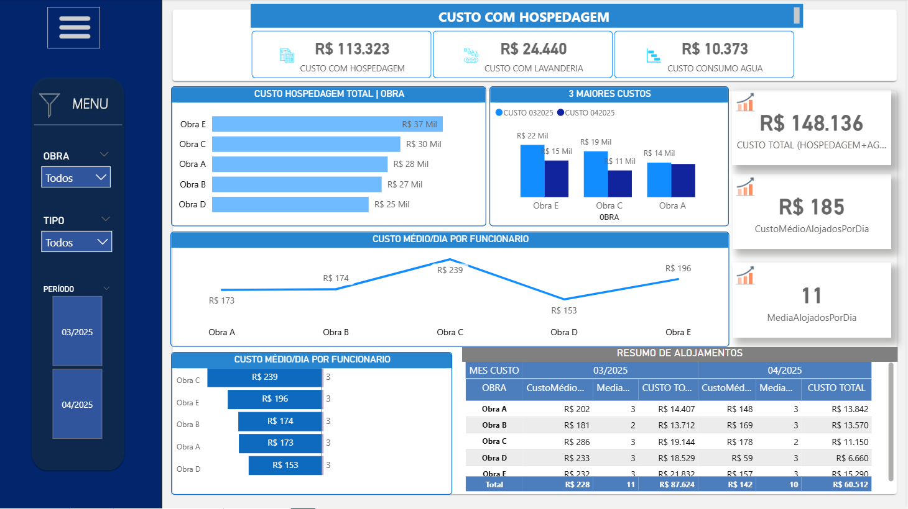

# 📊 Controle de Hospedagens - Power BI

Este relatório foi desenvolvido para **otimizar a visualização e gestão das hospedagens de funcionários** nas obras, atendendo a uma demanda real da empresa.

---
### 🛠️ Tecnologias e Conceitos

**Ferramentas utilizadas:**

---

### 🔄 Modelagem e ETL

- ETL realizado no Power Query (limpeza, unpivot, filtros)
- Medidas DAX: `SUM`, `AVERAGE`, `DISTINCTCOUNT`
- Criação de tabela calendário personalizada para análises temporais
- Relacionamentos (joins) definidos entre fato e dimensões (modelo star schema)
- Design visual feito no **Canva**, com foco em clareza e leitura

---
### 🧩 Visão Geral do Dashboard

🧩 Distribuição por Funcionário

🚀 **Click abaixo e veja meu Dashboard publicado**:  

