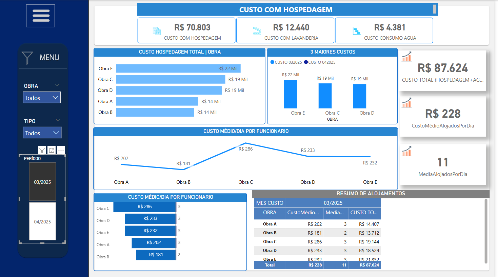
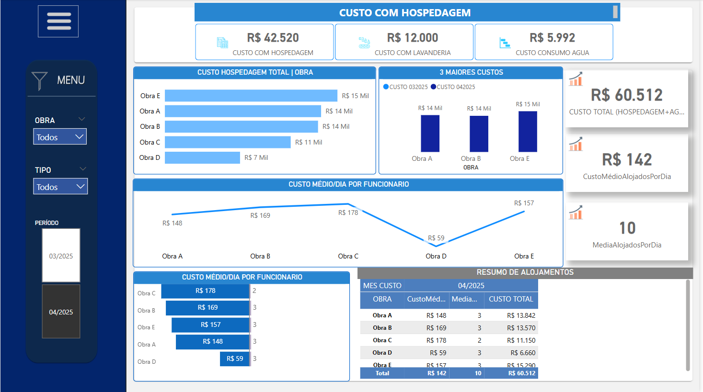
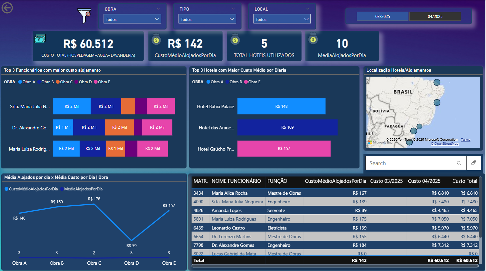
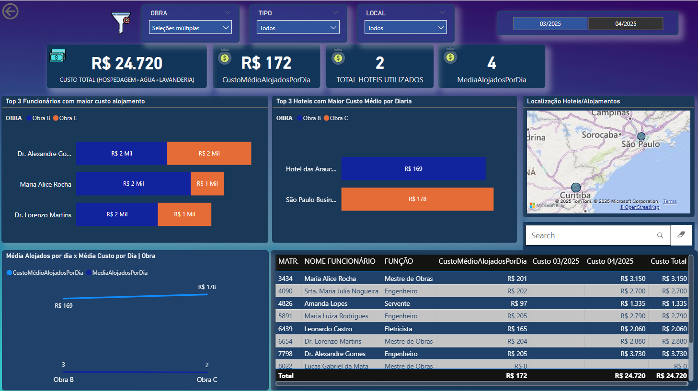

# 📊 Controle de Hospedagens - Power BI

Dashboard criado para acompanhar os custos e total de hospedagens de funcionários em diferentes obras ao longo de 2025.

🧩 Visão Geral do Dashboard

📝 Gráficos de linhas e colunas exibem o custo total de hospedagem por obra, as 3 obras com maiores custos no período, cartões separando custo com diárias, lavanderia, consumo de água e totais, média de alojados por dia e custo médio de alojados por dia.

💡 É interessante observar que, no mês de março/2025, embora a obra E apresente o maior custo total em reais no período, uma análise mais detalhada revela que a obra C possui o maior custo diário por pessoa. Esse tipo de comparação permite extrair insights mais precisos e avaliar os custos de forma realista, obra por obra.

Os indicadores e gráficos do dashboard auxiliam na identificação das frentes de trabalho que estão gerando maiores despesas, oferecendo uma visão estratégica para o controle financeiro.

🧩 Distribuição por Funcionário

📝 Visualização dos colaboradores que geraram as maiores despesas com hospedagem, destacando o top 3 funcionários com maior custo de alojamento e o top 3 hotéis com maior custo médio por dia.

Cartões exibem os principais indicadores: custo total, custo médio diário, total de hotéis utilizados e média de alojados por dia.

💡 Além disso, um gráfico de mapa facilita a análise geográfica, permitindo identificar regiões com variações nos preços e oferecendo insights importantes para o controle individual das despesas.

## 🔧 Ferramentas utilizadas

- Power BI Desktop
- Excel (como fonte de dados)
- Transformações via Power Query
